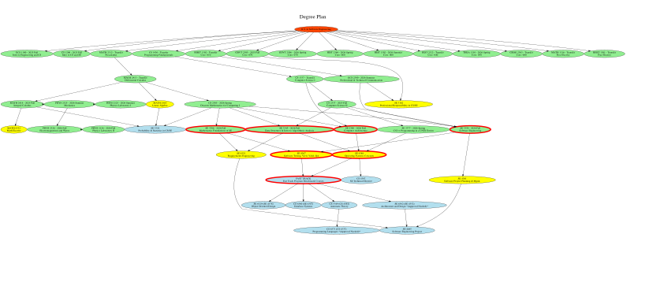

# Course Graph

Generates a graph of courses and their prerequisites.

## How to run

`npm install` to download dependencies

`npm run start` to generate Course Graph.svg from the current courses.yaml
`npm run plan` to output markdown formatted plan from courses.yaml

## Output

